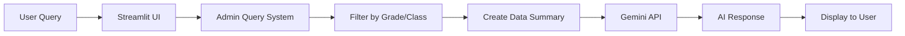

# 🎓 Dumroo AI Admin Panel

[](https://www.python.org/downloads/)
[](https://streamlit.io)
[](https://ai.google.dev/)
[](https://opensource.org/licenses/MIT)

> **AI-powered natural language query system for school administrators** — Ask questions about student data in plain English and get instant insights!

Built with **Google Gemini API** (FREE tier) • **Streamlit** • **Python** • **Pandas**

---

## 🌟 Features

✅ **Natural Language Queries** — No SQL or complex filters needed  
✅ **Role-Based Access Control** — Admins see only their grade/class data  
✅ **Real-time AI Responses** — Powered by Google Gemini 1.5 Flash  
✅ **Interactive Web UI** — Beautiful Streamlit dashboard  
✅ **100% Free** — Uses Gemini's generous free tier (1,500 requests/day)  
✅ **Easy Setup** — 5-minute installation with comprehensive testing  

---

## 🚀 Quick Start

```bash
# 1. Clone and navigate
git clone <your_repo_url>
cd dumroo_ai_gemini

# 2. Install dependencies
pip install -r requirements.txt

# 3. Get FREE Gemini API key from https://aistudio.google.com/app/apikey

# 4. Create .env file
echo "GEMINI_API_KEY=your_key_here" > .env

# 5. Generate sample data
python create_sample_data.py

# 6. Test setup
python test_setup.py

# 7. Launch app!
streamlit run streamlit_app_gemini.py
```

**That's it!** 🎉 Open http://localhost:8501 in your browser.

---

## 💬 Example Queries

Ask natural questions like:

| Query | What it does |
|-------|-------------|
| "Which students haven't submitted homework yet?" | Lists all students with pending homework |
| "Show me students who scored below 70 in quizzes" | Filters low-performing students |
| "What's the average quiz score for Grade 8?" | Calculates class performance metrics |
| "List upcoming quizzes next week" | Shows scheduled assessments |
| "Who scored the highest in Math Quiz 1?" | Identifies top performers |

---

## 🧩 Project Structure

```
dumroo_ai_gemini/
│
├── streamlit_app_gemini.py      # 🎛️ Web UI (Streamlit dashboard)
├── ai_query_system_gemini.py    # 🧠 AI backend (Gemini integration)
├── create_sample_data.py        # 🧮 Data generator
├── test_setup.py                # ✅ Setup verification script
├── list_available_models.py     # 📋 Check available Gemini models
│
├── student_data.csv             # 📂 Sample student dataset
├── student_data.json            # 📂 Same data in JSON format
│
├── .env                         # 🔑 API keys (DO NOT COMMIT!)
├── .gitignore                   # 🚫 Protects sensitive files
├── requirements.txt             # 📦 Python dependencies
└── README.md                    # 📖 This file
```

---

## ⚙️ Detailed Setup

### 1️⃣ Prerequisites

- **Python 3.10+** ([Download](https://www.python.org/downloads/))
- **Gemini API Key** ([Get FREE key](https://aistudio.google.com/app/apikey))
- Basic command line knowledge

### 2️⃣ Installation

#### Create Virtual Environment (Recommended)

```bash
# Create venv
python -m venv venv

# Activate it
source venv/bin/activate      # macOS/Linux
venv\Scripts\activate         # Windows
```

#### Install Dependencies

```bash
pip install -r requirements.txt
```

**requirements.txt contents:**
```
google-generativeai>=0.3.0
pandas>=2.0.0
streamlit>=1.30.0
python-dotenv>=1.0.0
```

### 3️⃣ Configure API Key

Create a `.env` file in the project root:

```bash
GEMINI_API_KEY=AIzaSy...your_actual_key_here
```

**Get your FREE key:** https://aistudio.google.com/app/apikey

> **Note:** The free tier includes:
> - 15 requests per minute
> - 1,500 requests per day  
> - No credit card required!

### 4️⃣ Generate Sample Data

```bash
python create_sample_data.py
```

This creates:
- `student_data.csv` — 13 students across grades 8-10
- `student_data.json` — Same data in JSON format

### 5️⃣ Verify Setup

```bash
python test_setup.py
```

This checks:
- ✅ All packages installed
- ✅ API key configured correctly  
- ✅ Data files exist
- ✅ Gemini API connection works

---

## 🎮 Usage

### Option 1: Web Interface (Recommended)

```bash
streamlit run streamlit_app_gemini.py
```

Then open **http://localhost:8501** in your browser.

**Features:**
- 💬 Chat-style interface
- 📊 Real-time data preview
- 🎯 Grade/class access control
- 💾 Download filtered data as CSV
- 📈 Quick statistics dashboard

### Option 2: Command Line

```bash
python ai_query_system_gemini.py
```

Runs example queries directly in the terminal.

---

## 📊 Dataset Schema

| Column | Type | Description | Example |
|--------|------|-------------|---------|
| `student_id` | String | Unique identifier | S001 |
| `student_name` | String | Full name | Aarav Kumar |
| `grade` | Integer | Grade level | 8, 9, 10 |
| `class_section` | String | Class section | A, B |
| `homework_title` | String | Assignment name | Math Chapter 5 Exercise |
| `submission_status` | String | Status | Submitted / Not Submitted |
| `submission_date` | String | Date or N/A | 2025-11-10 |
| `quiz_name` | String | Quiz title | Math Quiz 1 |
| `quiz_score` | Mixed | Score or N/A | 83, N/A |
| `quiz_date` | String | Quiz date | 2025-11-06 |
| `quiz_scheduled_date` | String | Upcoming quiz date | 2025-11-19 |

**Sample Row:**
```csv
S001,Aarav Kumar,8,A,Math Chapter 5 Exercise,Submitted,2025-11-10,English Quiz 1,72,2025-11-04,2025-11-19
```

---

## 🧠 How It Works



1. **User asks a question** in natural language
2. **System filters data** based on admin's access rights (grade/class)
3. **Data summary created** with relevant student info
4. **Sent to Gemini API** with structured prompt
5. **AI generates response** understanding context
6. **Result displayed** in chat interface

**Example Prompt to Gemini:**
```
You are analyzing student data for a school administrator.

QUESTION: Which students scored below 70 in quizzes?

DATA:
- Total Students: 5
- Students: Aarav Kumar, Priya Sharma, Rohan Patel...
- Quiz Data: [{"student_name": "Aarav Kumar", "quiz_score": 69}, ...]

Answer clearly with student names and scores.
```

---

## 🔐 Security & Privacy

### Role-Based Access Control
- ✅ Admins see **only their assigned grade and class**
- ✅ Cannot access other grades/classes
- ✅ Filters applied **before** AI processing

### API Key Protection
- ⚠️ **Never commit `.env` file** to Git
- ✅ `.gitignore` prevents accidental commits
- ✅ Use environment variables in production

### Data Privacy
- ✅ Sample data only (no real student information)
- ✅ Easily connect to your own secure database
- ✅ No data sent to third parties except Gemini API

---

## 🛠️ Troubleshooting

| Issue | Solution |
|-------|----------|
| ❌ "GEMINI_API_KEY not found" | Check `.env` file exists with correct key |
| ❌ "Module 'google.generativeai' not found" | Run `pip install google-generativeai` |
| ❌ "student_data.csv not found" | Run `python create_sample_data.py` |
| ⚠️ "Invalid API key" | Get new key from [AI Studio](https://aistudio.google.com/app/apikey) |
| ⚠️ "Rate limit exceeded" | Wait 1 minute (free tier: 15 req/min) |
| ❌ Streamlit won't start | Try different port: `streamlit run app.py --server.port 8502` |

### Check Available Models

```bash
python list_available_models.py
```

Shows all Gemini models your API key can access.

---

## 📈 Future Enhancements

- [ ] 📊 Add charts for quiz score trends
- [ ] 🗄️ Connect to real database (PostgreSQL/Firebase)
- [ ] 👤 Add teacher authentication system
- [ ] 📄 Export reports as PDF/Excel
- [ ] 🎤 Voice query support (Gemini Audio API)
- [ ] 📧 Email notifications for low performers
- [ ] 📱 Mobile-responsive design
- [ ] 🌐 Multi-language support

---

## 🤝 Contributing

Contributions welcome! Please:

1. Fork the repository
2. Create a feature branch (`git checkout -b feature/AmazingFeature`)
3. Commit changes (`git commit -m 'Add AmazingFeature'`)
4. Push to branch (`git push origin feature/AmazingFeature`)
5. Open a Pull Request

---

## 📝 License

This project is licensed under the **MIT License** - see [LICENSE](LICENSE) file for details.

---

## 🙏 Acknowledgments

- **Dumroo.ai** — For the inspiring assignment
- **Google AI** — For the generous Gemini API free tier
- **Streamlit** — For the amazing UI framework
- **LangChain** — For AI integration patterns

---

## 👨‍💻 Author

**Rakesh Vemula**  
B.Tech — Computer Science & Engineering  
Enrollment No: BT22CSE028

📧 Email: [rakeshvemula15@gmail.com]  
🔗 LinkedIn: [linkedin.com/in/yourprofile](https://linkedin.com/in/yourprofile)  
🐙 GitHub: [@yourusername](https://github.com/yourusername)

---

## 📸 Screenshots


---

<div align="center">

**⭐ Star this repo if you find it helpful!**

Made with ❤️ 

</div>